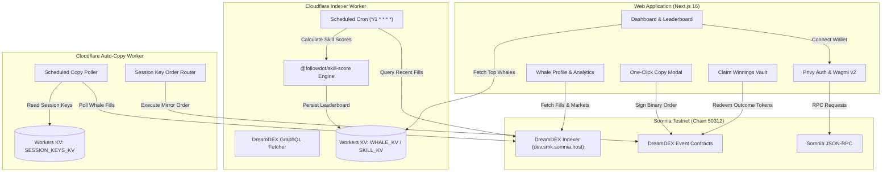

# Followdot

> **Follow the smart money.**
> Smart-money mirror & copy-trading platform for DreamDEX Event Contracts on Somnia.

[-10b981?style=for-the-badge)](https://somnia.network)
[](https://www.typescriptlang.org/)
[](https://nextjs.org/)
[](https://workers.cloudflare.com/)
[](https://privy.io)

---

## 📌 Overview

**Followdot** allows prediction market traders on Somnia to discover, analyze, and automatically copy top-performing "whales" trading [DreamDEX Event Contracts](https://docs.dreamdex.io/developers/event-contracts).

Rather than ranking traders by raw profit & loss—which often rewards high-variance, lucky bets—Followdot introduces a mathematically grounded **Bayesian Skill Scoring Engine**. We rank traders based on statistical edge, trade consistency across event categories, and risk-adjusted return.

Traders can mirror top whales with **One-Click Manual Copying** or enable **Automated Mirroring via Non-Custodial Session Keys**.

---

## ✨ Key Features

- 🏆 **Smart-Money Leaderboard**: Discovers and ranks top prediction market traders using Bayesian win-rate shrinkage ($\alpha=5$), consistency factors, and PnL variance penalties.
- 📊 **Deep Whale Analytics**: Detailed whale profile pages with trade history, outcome win-rates per event category, and SVG equity curve visualizations.
- ⚡ **One-Click Manual Copying**: Pre-configures and executes binary market orders (`BUY_YES` / `BUY_NO`) directly on Somnia Testnet via `@somnia-chain/markets-sdk`.
- 🔑 **Automated Session-Key Copying**: Non-custodial background worker (`apps/autocopy`) that automatically mirrors whale trades in real time using limited-permission session keys.
- 💰 **Winnings Vault / Claim Engine**: Aggregates all settled outcome tokens across active prediction markets into a single-click payout redemption vault (`/claim`).
- 🔒 **Privy Authentication & Somnia Network Enforcement**: Seamless social, Web3, and embedded wallet onboarding powered by Privy, with strict inline Somnia Testnet (`chainId: 50312`) network verification.

---

## 🏗 System Architecture



---

## 📐 Bayesian Skill Scoring Algorithm

Raw win rates on small trade samples lead to skewed rankings (e.g., a trader with 1 win has a 100% win rate). Followdot solves this using **Laplace Smoothing (Bayesian Shrinkage)** combined with market consistency and PnL variance metrics:

### 1. Bayesian Win Rate Shrinkage ($\alpha=5$)
$$\text{Shrunk Win Rate } (\hat{w}) = \frac{k + \alpha}{n + 2\alpha}$$
*where $k$ is successful trades, $n$ is total trades, and $\alpha=5$ grounds small sample sizes toward a 50% baseline.*

### 2. Market-Type Consistency Factor ($C$)
Traders are evaluated across distinct event categories (e.g., Crypto, Macro, Sports). $C$ reflects the proportion of buckets where the trader maintains an edge ($\hat{w} > 0.5$).

### 3. Variance Penalty ($V$)
To penalize high-risk, volatile traders, we compute the Coefficient of Variation ($CV$) of realized trade PnL:
$$V = \min\left(0.5, \frac{\sigma_{\text{pnl}}}{|\mu_{\text{pnl}}| + \epsilon}\right)$$

### 4. Final Skill Score Formula
$$\text{Skill Score} = \max\left(0, \min\left(1, \hat{w} \times C \times (1 - V)\right)\right)$$

---

## 📁 Repository Structure

```
followdot/
├── apps/
│   ├── web/               # Next.js 16 + Tailwind v4 + shadcn/ui + Privy + Wagmi
│   │   ├── src/app/       # App Router pages (Dashboard, Performance, Claim, Settings, Whale Profile)
│   │   ├── src/components/# UI components, EquityCurve, Sparkline, CopyOrderModal
│   │   ├── src/lib/        # DreamDEX & whale analytics data adapters
│   │   └── src/providers/  # PrivyProvider & WagmiProvider setup
│   ├── indexer/           # Cloudflare Worker for background whale indexing & skill scoring
│   └── autocopy/          # Cloudflare Worker for session-key automated copy-trading
├── packages/
│   ├── skill-score/       # Pure TypeScript Bayesian skill-score engine (14 Vitest unit tests)
│   └── sdk-helpers/       # Typed wrappers around @somnia-chain/markets-sdk & Viem
├── plans/
│   ├── hackathon-deep-dive.md    # Competition context & judging rubric
│   └── followdot-product-spec.md # Product architecture & resolved decisions
└── AGENTS.md              # Living development checkpoint log
```

---

## ⚡ Quickstart & Local Setup

### Prerequisites

- **Node.js**: `^20.0.0` or higher
- **pnpm**: `^9.0.0` or higher
- **Privy App ID**: Get a free App ID at [dashboard.privy.io](https://dashboard.privy.io/)

### 1. Installation

```bash
git clone https://github.com/your-org/followdot.git
cd followdot
pnpm install
```

### 2. Environment Configuration

Copy `.env.example` to `.env` and `.env.local` inside `apps/web`:

```bash
cp .env.example .env
cp .env.example apps/web/.env.local
```

Set your Privy App ID inside `.env`:

```ini
NEXT_PUBLIC_CHAIN_ID=50312
NEXT_PUBLIC_RPC_URL=https://dream-rpc.somnia.network
NEXT_PUBLIC_DREAMDEX_REST=https://dev.smk.somnia.host/v1/graphql
NEXT_PUBLIC_DREAMDEX_WS=wss://api.infra.testnet.somnia.network/ws
NEXT_PUBLIC_PRIVY_APP_ID=your_privy_app_id
```

### 3. Run Tests & Validation

```bash
# Run all unit tests (skill-score & web packages)
pnpm test

# Run TypeScript typechecks
pnpm --filter web typecheck

# Run ESLint validation
pnpm --filter web lint

# Build all packages & workers
pnpm build
```

### 4. Launch Development Servers

```bash
# Launch Next.js web application
pnpm dev

# (Optional) Launch Cloudflare Indexer worker locally
pnpm --filter @followdot/indexer dev

# (Optional) Launch Cloudflare Auto-Copy worker locally
pnpm --filter @followdot/autocopy dev --port 8788
```

Open `http://localhost:3000` in your browser.

---

## 🔒 Security & Non-Custodial Guarantee

- **Session Key Sandboxing**: Auto-copy session keys generated by DreamDEX session key manager are strictly constrained on-chain to calling binary order placement functions (`placeCopyOrder`).
- **Zero Withdrawal Authority**: Session keys **cannot** initiate ERC-20 transfers, withdraw collateral, or execute arbitrary smart contract calls.
- **Zero Mock Data Policy**: All analytics, win rates, and positions displayed in the application are derived directly from indexed on-chain fills and DreamDEX event contract states.

---

## 📜 License

[MIT License](LICENSE)
